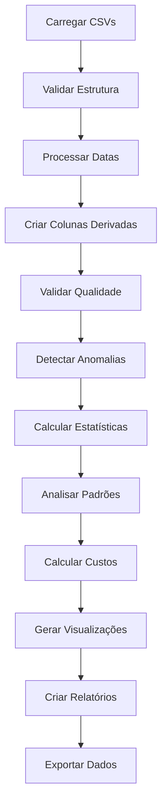

# Validação do Notebook - Análise de Consumo de Eletricidade

**Data:** 31 de janeiro de 2026  
**Objetivo:** Documentação detalhada para uso nos próximos anos

---

## Índice

1. [O Que Existe Atualmente](#o-que-existe-atualmente)
2. [O Que Pode Ser Adicionado](#o-que-pode-ser-adicionado)
3. [O Que Pode Ser Melhorado](#o-que-pode-ser-melhorado)
4. [Prioridades de Implementação](#prioridades-de-implementação)
5. [Recomendações de Arquitetura](#recomendações-de-arquitetura)

---

## O Que Existe Atualmente

### ✅ Pontos Fortes

#### 1. **Estrutura de Dados**
- **Formato CSV bem definido:** 4 colunas essenciais (Data, Hora, Consumo, Estado)
- **Dados em intervalos de 15 minutos:** Resolução adequada para análise detalhada
- **Separação entre dados reais e estimados:** Permite análise de qualidade dos dados
- **Nomenclatura consistente:** Arquivos com padrão `consumo_NOME_MES.csv`

#### 2. **Carregamento Automático**
- **Detecção automática de ficheiros:** Usa `glob` para encontrar todos os CSVs
- **Processamento unificado:** Função `carregar_csv()` padroniza o tratamento
- **Combinação de múltiplos meses:** `pd.concat()` agrega todos os dados
- **Criação de colunas derivadas:** Dia, Mês, Ano, DiaSemana, HoraNum, DataHora

#### 3. **Análise Exploratória**
- **Estatísticas básicas:** `describe()` fornece visão geral
- **Agregações por período:** Por mês, dia da semana, hora do dia
- **Identificação de picos:** `nlargest()` para top 20 momentos
- **Cálculo de custo:** Tarifa configurável (€0.25/kWh)

#### 4. **Visualizações (9 gráficos)**
1. Consumo ao longo do tempo (line plot)
2. Consumo total por arquivo/mês (bar plot)
3. Consumo por dia da semana (bar plot)
4. Consumo médio por hora (bar plot)
5. Boxplot por dia da semana
6. Consumo por mês (bar plot)
7. Comparação de consumo por hora entre meses (line plot)
8. Custo por arquivo/mês (bar plot com linha média)
9. Tendência de consumo por mês (line plot)

#### 5. **Exportação de Dados**
- **Dados combinados processados:** CSV completo
- **Resumos agregados:** Por arquivo e por mês
- **Dados individuais:** Cada mês exportado separadamente

#### 6. **Resumo Final**
- **Relatório consolidado:** Período, totais, extremos
- **Comparação mensal:** Mês com maior/menor consumo
- **Análise por dia da semana:** Padrões semanais

### ⚠️ Limitações Atuais

#### 1. **Configuração**
- **Tarifa hardcoded:** `tarifa = 0.25` no código
- **Caminhos fixos:** `DATA_DIR = 'data'`, `PROCESSED_DIR = 'processed'`
- **Sem ficheiro de configuração:** Parâmetros dispersos no notebook

#### 2. **Validação de Dados**
- **Sem verificação de integridade:** Não verifica se há dados faltantes
- **Sem detecção de anomalias:** Não identifica valores inconsistentes
- **Sem validação de formato:** Assume que CSVs estão corretos

#### 3. **Análise**
- **Sem análise sazonal:** Não compara meses equivalentes de anos diferentes
- **Sem análise de tendência:** Não usa métodos estatísticos para tendências
- **Sem previsão:** Não projeta consumo futuro
- **Sem análise de eficiência:** Não compara com benchmarks

#### 4. **Visualizações**
- **Estilo fixo:** `seaborn-v0_8-darkgrid` hardcoded
- **Sem interatividade:** Gráficos estáticos do matplotlib
- **Sem heatmaps:** Não mostra padrões temporais em 2D
- **Sem gráficos de distribuição:** Não mostra histogramas ou KDE

#### 5. **Código**
- **Função única de carregamento:** `carregar_csv()` faz tudo
- **Sem modularização:** Tudo no notebook, sem módulos separados
- **Sem logging:** Usa apenas `print()` para feedback
- **Sem tratamento de erros:** Não usa try/except

#### 6. **Documentação**
- **Docstrings mínimas:** Apenas descrições básicas
- **Sem exemplos de uso:** Não mostra como usar cada função
- **Sem explicações de conceitos:** Assume conhecimento prévio

---

## O Que Pode Ser Adicionado

### 🎯 Funcionalidades de Alto Valor

#### 1. **Sistema de Configuração**
```python
# config.yaml ou config.json
tarifa:
  normal: 0.25
  bi_horario:
    vazio: 0.104
    cheia: 0.2584
  tri_horario:
    vazio: 0.104
    ponta: 0.312
    cheia: 0.2584

caminhos:
  dados: "data"
  processados: "processed"
  relatorios: "reports"

analise:
  periodo_pico: [18, 22]  # 18h-22h
  periodo_vazio: [0, 7]    # 00h-07h
  dias_uteis: [0, 1, 2, 3, 4]  # Seg-Sex
```

**Benefício:** Facilita ajustes sem modificar código, suporta diferentes tarifas.

#### 2. **Validação de Qualidade de Dados**
```python
def validar_dados(df):
    """Valida integridade e qualidade dos dados."""
    relatorio = {
        'registros_faltantes': [],
        'valores_anomalos': [],
        'inconsistencias_temporais': []
    }
    
    # Verificar intervalos de 15 minutos
    # Detectar valores negativos
    # Identificar saltos abruptos
    # Verificar continuidade temporal
    
    return relatorio
```

**Benefício:** Detecta problemas antes da análise, aumenta confiança nos resultados.

#### 3. **Análise de Padrões Sazonais**
```python
def analise_sazonal(df):
    """Compara meses equivalentes entre anos."""
    # Janeiro 2025 vs Janeiro 2026
    # Verão vs Inverno
    # Feriados vs Dias normais
    pass
```

**Benefício:** Identifica padrões anuais, ajuda a prever consumo sazonal.

#### 4. **Cálculo com Tarifas Reais**
```python
def calcular_custo_tarifa_real(df, tipo_tarifa='bi_horario'):
    """Calcula custo com tarifas portuguesas reais."""
    if tipo_tarifa == 'bi_horario':
        # Horário de vazio: 00h-07h, 22h-24h
        # Horário cheio: 07h-22h
        pass
    elif tipo_tarifa == 'tri_horario':
        # Vazio: 00h-07h, 22h-24h
        # Ponta: 18h-21h
        # Cheia: restante
        pass
```

**Benefício:** Estimativas de custo mais realistas, possibilidade de otimização.

#### 5. **Análise de Eficiência**
```python
def benchmark_consumo(df):
    """Compara com médias de consumo residencial."""
    # Média portuguesa: ~150 kWh/mês
    # Média europeia: ~200 kWh/mês
    # Comparar por área habitacional
    pass
```

**Benefício:** Contextualiza o consumo, identifica oportunidades de economia.

#### 6. **Detecção de Anomalias**
```python
def detectar_anomalias(df, metodo='zscore'):
    """Identifica padrões incomuns de consumo."""
    if metodo == 'zscore':
        # Valores > 3 desvios padrão
        pass
    elif metodo == 'isolation_forest':
        # Machine learning para outliers
        pass
```

**Benefício:** Alerta para problemas elétricos ou erros de medição.

#### 7. **Previsão de Consumo**
```python
def prever_consumo(df, dias_futuros=7):
    """Prevê consumo usando séries temporais."""
    # Usar Prophet ou statsmodels
    # Considerar sazonalidade
    # Intervalos de confiança
    pass
```

**Benefício:** Planejamento financeiro, antecipação de picos.

#### 8. **Dashboard Interativo**
```python
# Usar Plotly Dash ou Streamlit
import streamlit as st

st.title("Dashboard de Consumo de Eletricidade")
st.line_chart(df.set_index('DataHora')['Consumo'])
st.sidebar.selectbox("Selecione o período", ...)
```

**Benefício:** Visualização interativa, exploração dinâmica de dados.

#### 9. **Exportação de Relatórios**
```python
def gerar_relatorio_pdf(df, caminho):
    """Gera relatório em PDF com gráficos e análises."""
    # Usar reportlab ou matplotlib + pdf
    # Incluir resumo, gráficos, recomendações
    pass
```

**Benefício:** Documentação profissional, fácil partilha.

#### 10. **Alertas Automáticos**
```python
def configurar_alertas(df):
    """Configura alertas para condições específicas."""
    # Consumo diário > X kWh
    # Pico > Y kW
    # Aumento > Z% vs mês anterior
    pass
```

**Benefício:** Monitorização proativa, resposta rápida a problemas.

---

## O Que Pode Ser Melhorado

### 🔧 Melhorias de Baixo Esforço, Alto Impacto

#### 1. **Modularização do Código**
**Atual:**
```python
# Tudo no notebook, uma função gigante
def carregar_csv(caminho_ficheiro):
    # 60 linhas de código
```

**Melhorado:**
```python
# src/data_loader.py
def carregar_csv(caminho_ficheiro):
    """Carrega um ficheiro CSV."""
    return pd.read_csv(caminho_ficheiro, encoding='utf-8-sig')

def processar_datas(df):
    """Processa colunas de data."""
    df['Data'] = pd.to_datetime(df['Data'], format='%Y/%m/%d')
    df['Hora'] = pd.to_datetime(df['Hora'], format='%H:%M').dt.time
    return df

def criar_colunas_derivadas(df):
    """Cria colunas para análise."""
    df['DataHora'] = df.apply(lambda row: datetime.combine(row['Data'], row['Hora']), axis=1)
    df['DiaSemana'] = df['Data'].dt.dayofweek
    df['HoraNum'] = df['DataHora'].dt.hour
    return df
```

**Benefício:** Código mais legível, testável, reutilizável.

#### 2. **Tratamento de Erros**
**Atual:**
```python
df = pd.read_csv(caminho_ficheiro, encoding='utf-8-sig')
# Se falhar, crash sem explicação
```

**Melhorado:**
```python
try:
    df = pd.read_csv(caminho_ficheiro, encoding='utf-8-sig')
except FileNotFoundError:
    logger.error(f"Ficheiro não encontrado: {caminho_ficheiro}")
    raise
except pd.errors.EmptyDataError:
    logger.error(f"Ficheiro vazio: {caminho_ficheiro}")
    raise
except Exception as e:
    logger.error(f"Erro ao carregar {caminho_ficheiro}: {e}")
    raise
```

**Benefício:** Debugging mais fácil, mensagens de erro claras.

#### 3. **Logging Profissional**
**Atual:**
```python
print("✓ Carregado: {nome} ({len(df)} registros)")
```

**Melhorado:**
```python
import logging

logging.basicConfig(
    level=logging.INFO,
    format='%(asctime)s - %(name)s - %(levelname)s - %(message)s',
    handlers=[
        logging.FileHandler('analise.log'),
        logging.StreamHandler()
    ]
)

logger = logging.getLogger(__name__)
logger.info(f"Carregado: {nome} ({len(df)} registros)")
```

**Benefício:** Rastreabilidade, histórico de execuções, nível de detalhe configurável.

#### 4. **Validação de Entrada**
**Atual:**
```python
tarifa = 0.25  # Assume valor correto
```

**Melhorado:**
```python
def validar_tarifa(tarifa):
    """Valida valor da tarifa."""
    if not isinstance(tarifa, (int, float)):
        raise TypeError("Tarifa deve ser numérica")
    if tarifa <= 0:
        raise ValueError("Tarifa deve ser positiva")
    if tarifa > 1.0:
        logger.warning(f"Tarifa alta: €{tarifa}/kWh")
    return tarifa

tarifa = validar_tarifa(config['tarifa']['normal'])
```

**Benefício:** Captura erros cedo, documentação clara de requisitos.

#### 5. **Cache de Resultados**
**Atual:**
```python
# Recalcula tudo a cada execução
consumo_por_mes = df_real.groupby(['Ano', 'Mes'])['Consumo'].sum()
```

**Melhorado:**
```python
from functools import lru_cache

@lru_cache(maxsize=128)
def calcular_consumo_por_mes(df_hash):
    """Calcula consumo por mês com cache."""
    return df_real.groupby(['Ano', 'Mes'])['Consumo'].sum()

# Ou usar joblib para persistência
from joblib import Memory
memory = Memory('./cache', verbose=0)

@memory.cache
def processar_dados(df):
    """Processa dados com cache persistente."""
    # processamento pesado
    return resultado
```

**Benefício:** Execuções mais rápidas, especialmente em desenvolvimento.

#### 6. **Testes Automáticos**
**Atual:**
```python
# Sem testes, confia no código
```

**Melhorado:**
```python
# tests/test_data_loader.py
import pytest

def test_carregar_csv():
    """Testa carregamento de CSV."""
    df = carregar_csv('data/teste.csv')
    assert len(df) > 0
    assert 'Consumo registado (kW)' in df.columns
    assert df['Consumo registado (kW)'].min() >= 0

def test_processar_datas():
    """Testa processamento de datas."""
    df = pd.DataFrame({'Data': ['2026/01/01']})
    df = processar_datas(df)
    assert pd.api.types.is_datetime64_any_dtype(df['Data'])
```

**Benefício:** Regressão de bugs, confiança em refatorações.

#### 7. **Type Hints**
**Atual:**
```python
def carregar_csv(caminho_ficheiro):
    """Carrega um ficheiro CSV."""
    ...
```

**Melhorado:**
```python
from typing import Tuple
import pandas as pd

def carregar_csv(caminho_ficheiro: str) -> Tuple[pd.DataFrame, str]:
    """Carrega um ficheiro CSV e retorna DataFrame e nome do ficheiro.
    
    Args:
        caminho_ficheiro: Caminho para o ficheiro CSV.
        
    Returns:
        Tupla com (DataFrame, nome do ficheiro).
        
    Raises:
        FileNotFoundError: Se o ficheiro não existir.
        ValueError: Se o formato for inválido.
    """
    ...
```

**Benefício:** Autocompletar melhor, verificação de tipos, documentação integrada.

#### 8. **Parâmetros Configuráveis**
**Atual:**
```python
plt.figure(figsize=(20, 8))
plt.plot(df_real['DataHora'], df_real['Consumo registado (kW)'], 
         linewidth=0.3, alpha=0.6)
```

**Melhorado:**
```python
def plotar_consumo_temporal(df, figsize=(20, 8), linewidth=0.3, alpha=0.6):
    """Plota consumo ao longo do tempo."""
    plt.figure(figsize=figsize)
    plt.plot(df['DataHora'], df['Consumo'], linewidth=linewidth, alpha=alpha)
    plt.title('Consumo de Eletricidade ao Longo do Tempo')
    plt.show()

# Uso com configuração
config = {
    'plot': {
        'figsize': (20, 8),
        'linewidth': 0.3,
        'alpha': 0.6
    }
}
plotar_consumo_temporal(df, **config['plot'])
```

**Benefício:** Flexibilidade, fácil personalização.

#### 9. **Documentação de Funções**
**Atual:**
```python
def carregar_csv(caminho_ficheiro):
    """Carrega um ficheiro CSV e retorna um DataFrame processado."""
    ...
```

**Melhorado:**
```python
def carregar_csv(caminho_ficheiro: str) -> Tuple[pd.DataFrame, str]:
    """Carrega e processa um ficheiro CSV de consumo de eletricidade.
    
    Esta função lê um ficheiro CSV, valida a estrutura, converte tipos
    de dados e cria colunas derivadas para análise.
    
    O ficheiro deve ter as seguintes colunas:
        - Data: Data no formato YYYY/MM/DD
        - Hora: Hora no formato HH:MM
        - Consumo registado (kW): Consumo em kilowatts
        - Estado: 'Real' ou 'Estimado'
    
    Args:
        caminho_ficheiro: Caminho absoluto ou relativo para o ficheiro CSV.
        
    Returns:
        Uma tupla contendo:
            - DataFrame processado com colunas adicionais
            - Nome do ficheiro (sem caminho)
            
    Raises:
        FileNotFoundError: Se o ficheiro não existir.
        ValueError: Se o ficheiro não tiver as colunas esperadas.
        
    Example:
        >>> df, nome = carregar_csv('data/consumo_janeiro_2026.csv')
        >>> print(f"Carregado: {nome} com {len(df)} registros")
        Carregado: consumo_janeiro_2026.csv com 2976 registros
    """
    ...
```

**Benefício:** Documentação clara, exemplos de uso, especificação de contratos.

#### 10. **Performance**
**Atual:**
```python
# Iteração linha a linha
df['DataHora'] = df.apply(lambda row: datetime.combine(row['Data'], row['Hora']), axis=1)
```

**Melhorado:**
```python
# Vetorização
df['DataHora'] = pd.to_datetime(df['Data'].astype(str) + ' ' + df['Hora'].astype(str))

# Ou usando dt accessor
df['DataHora'] = df['Data'] + pd.to_timedelta(df['Hora'].astype(str))
```

**Benefício:** 10-100x mais rápido para grandes datasets.

---

## Prioridades de Implementação

### 🚀 Fase 1: Fundamentos (1-2 semanas)
**Objetivo:** Melhorar qualidade e manutenibilidade do código existente.

1. ✅ **Modularização** - Separar código em módulos
2. ✅ **Tratamento de erros** - Adicionar try/except
3. ✅ **Logging** - Implementar logging profissional
4. ✅ **Validação de dados** - Verificar integridade dos CSVs
5. ✅ **Configuração** - Criar ficheiro config.yaml

**Impacto:** Código mais robusto, fácil de manter e extender.

### 📊 Fase 2: Análise Avançada (2-3 semanas)
**Objetivo:** Adicionar análises mais sofisticadas.

1. ✅ **Tarifas reais** - Implementar bi-horário e tri-horário
2. ✅ **Análise sazonal** - Comparar meses entre anos
3. ✅ **Detecção de anomalias** - Identificar outliers
4. ✅ **Benchmarks** - Comparar com médias nacionais
5. ✅ **Heatmaps** - Visualizar padrões temporais

**Impacto:** Insights mais profundos, decisões mais informadas.

### 🔮 Fase 3: Previsão e Alertas (3-4 semanas)
**Objetivo:** Capacidades preditivas e proativas.

1. ✅ **Previsão de consumo** - Usar séries temporais
2. ✅ **Alertas automáticos** - Configurar notificações
3. ✅ **Otimização de tarifa** - Recomendar melhor tarifa
4. ✅ **Simulações** - Testar cenários "what-if"
5. ✅ **Tendências** - Análise de tendência estatística

**Impacto:** Planejamento financeiro, economia de custos.

### 🎨 Fase 4: Visualização e Relatórios (2-3 semanas)
**Objetivo:** Apresentação profissional dos resultados.

1. ✅ **Dashboard interativo** - Streamlit ou Plotly Dash
2. ✅ **Relatórios PDF** - Exportação automatizada
3. ✅ **Gráficos avançados** - Heatmaps, distribuições
4. ✅ **Comparação temporal** - Year-over-year
5. ✅ **KPIs** - Indicadores chave de performance

**Impacto:** Comunicação eficaz, fácil partilha de insights.

### 🧪 Fase 5: Qualidade de Software (contínuo)
**Objetivo:** Garantir qualidade e confiabilidade.

1. ✅ **Testes unitários** - Cobertura > 80%
2. ✅ **CI/CD** - Integração contínua
3. ✅ **Type hints** - Verificação de tipos
4. ✅ **Documentação** - Sphinx ou MkDocs
5. ✅ **Performance** - Otimização e profiling

**Impacto:** Código confiável, fácil de colaborar.

---

## Recomendações de Arquitetura

### 📁 Estrutura de Diretórios Sugerida

```
analise-eletricidade/
├── data/                          # Dados brutos
│   ├── consumo_janeiro_2026.csv
│   ├── consumo_fevereiro_2026.csv
│   └── .gitkeep
├── processed/                     # Dados processados
│   ├── dados_combinados.csv
│   └── .gitkeep
├── reports/                       # Relatórios gerados
│   ├── mensal/
│   └── anual/
├── cache/                         # Cache de cálculos
│   └── .gitkeep
├── src/                           # Código fonte
│   ├── __init__.py
│   ├── data_loader.py            # Carregamento de dados
│   ├── data_processor.py         # Processamento e validação
│   ├── analyzer.py               # Análises estatísticas
│   ├── visualizer.py             # Visualizações
│   ├── forecaster.py             # Previsões
│   ├── tariff_calculator.py      # Cálculo de tarifas
│   └── utils.py                  # Funções utilitárias
├── tests/                         # Testes
│   ├── __init__.py
│   ├── test_data_loader.py
│   ├── test_data_processor.py
│   └── test_analyzer.py
├── notebooks/                     # Notebooks
│   └── analise_consumo.ipynb
├── config/                        # Configurações
│   ├── config.yaml               # Configuração principal
│   └── tariffs.yaml              # Definições de tarifas
├── docs/                          # Documentação
│   ├── api.md
│   └── user_guide.md
├── scripts/                       # Scripts utilitários
│   ├── run_analysis.py           # Executar análise completa
│   ├── generate_report.py        # Gerar relatório
│   └── validate_data.py          # Validar dados
├── requirements.txt
├── setup.py
├── README.md
├── .gitignore
└── VALIDACAO_NOTEBOOK.md         # Este documento
```

### 🔧 Módulos Principais

#### 1. `data_loader.py`
```python
"""Módulo para carregamento de dados de consumo de eletricidade."""

from typing import List, Tuple
import pandas as pd
import logging
from pathlib import Path

logger = logging.getLogger(__name__)

def carregar_csv(caminho: str) -> pd.DataFrame:
    """Carrega um ficheiro CSV de consumo."""
    ...

def carregar_multiplos_csvs(diretorio: str) -> pd.DataFrame:
    """Carrega todos os CSVs de um diretório."""
    ...

def validar_estrutura(df: pd.DataFrame) -> bool:
    """Valida se o DataFrame tem a estrutura esperada."""
    ...
```

#### 2. `data_processor.py`
```python
"""Módulo para processamento e validação de dados."""

from typing import Dict, List
import pandas as pd
import numpy as np

def processar_datas(df: pd.DataFrame) -> pd.DataFrame:
    """Processa colunas de data e hora."""
    ...

def criar_colunas_derivadas(df: pd.DataFrame) -> pd.DataFrame:
    """Cria colunas para análise temporal."""
    ...

def validar_qualidade(df: pd.DataFrame) -> Dict:
    """Valida qualidade dos dados e retorna relatório."""
    ...

def limpar_dados(df: pd.DataFrame) -> pd.DataFrame:
    """Limpa e corrige dados."""
    ...
```

#### 3. `analyzer.py`
```python
"""Módulo para análises estatísticas de consumo."""

from typing import Dict, Tuple
import pandas as pd
import numpy as np
from scipy import stats

def calcular_estatisticas(df: pd.DataFrame) -> Dict:
    """Calcula estatísticas descritivas."""
    ...

def analisar_padroes_sazonais(df: pd.DataFrame) -> Dict:
    """Analisa padrões sazonais."""
    ...

def detectar_anomalias(df: pd.DataFrame, metodo: str = 'zscore') -> pd.DataFrame:
    """Detecta anomalias no consumo."""
    ...

def comparar_periodos(df: pd.DataFrame, periodo1: Tuple, periodo2: Tuple) -> Dict:
    """Compara consumo entre dois períodos."""
    ...
```

#### 4. `visualizer.py`
```python
"""Módulo para visualização de dados."""

import matplotlib.pyplot as plt
import seaborn as sns
import plotly.express as px
from typing import Optional

def plotar_consumo_temporal(df: pd.DataFrame, salvar: bool = False):
    """Plota consumo ao longo do tempo."""
    ...

def plotar_heatmap(df: pd.DataFrame, salvar: bool = False):
    """Plota heatmap de consumo por hora e dia."""
    ...

def plotar_distribuicao(df: pd.DataFrame, salvar: bool = False):
    """Plota distribuição de consumo."""
    ...

def criar_dashboard(df: pd.DataFrame):
    """Cria dashboard interativo."""
    ...
```

#### 5. `tariff_calculator.py`
```python
"""Módulo para cálculo de custos com diferentes tarifas."""

from typing import Dict
import pandas as pd

class Tarifa:
    """Classe base para tarifas."""
    ...

class TarifaBiHoraria(Tarifa):
    """Tarifa bi-horária."""
    ...

class TarifaTriHoraria(Tarifa):
    """Tarifa tri-horária."""
    ...

def calcular_custo_otimo(df: pd.DataFrame, tarifas: Dict) -> Dict:
    """Calcula custo ótimo e recomenda melhor tarifa."""
    ...
```

### 🔄 Fluxo de Trabalho Sugerido



### 📋 Checklist de Qualidade

#### Antes de Commitar
- [ ] Código segue PEP 8
- [ ] Funções têm docstrings
- [ ] Type hints adicionados
- [ ] Testes unitários escritos
- [ ] Logging implementado
- [ ] Erros tratados adequadamente
- [ ] Performance otimizada
- [ ] Documentação atualizada

#### Antes de Release
- [ ] Todos os testes passam
- [ ] Cobertura de testes > 80%
- [ ] Documentação completa
- [ ] README atualizado
- [ ] CHANGELOG.md atualizado
- [ ] Versão incrementada
- [ ] Tag criada no Git

---

## Conclusão

O notebook atual é uma **excelente base** para análise de consumo de eletricidade, com funcionalidades sólidas e uma estrutura clara. No entanto, há **oportunidades significativas** para melhorar a qualidade do código, adicionar análises avançadas e criar uma ferramenta mais robusta e profissional.

### Resumo de Recomendações

| Prioridade | Melhoria | Esforço | Impacto |
|------------|----------|---------|---------|
| Alta | Modularização | Médio | Alto |
| Alta | Tratamento de erros | Baixo | Alto |
| Alta | Logging | Baixo | Médio |
| Alta | Configuração | Baixo | Alto |
| Média | Tarifas reais | Médio | Alto |
| Média | Validação de dados | Médio | Alto |
| Média | Análise sazonal | Médio | Médio |
| Baixa | Dashboard | Alto | Médio |
| Baixa | Previsão | Alto | Médio |
| Baixa | Alertas | Médio | Baixo |

### Próximos Passos Imediatos

1. **Criar estrutura de módulos** (1 dia)
2. **Implementar logging e tratamento de erros** (1 dia)
3. **Criar ficheiro de configuração** (0.5 dia)
4. **Adicionar validação de dados** (1 dia)
5. **Implementar tarifas bi-horária e tri-horária** (2 dias)

**Total estimado:** 5.5 dias para melhorias fundamentais.

---

**Documento criado em:** 31 de janeiro de 2026  
**Próxima revisão sugerida:** Após implementação da Fase 1
